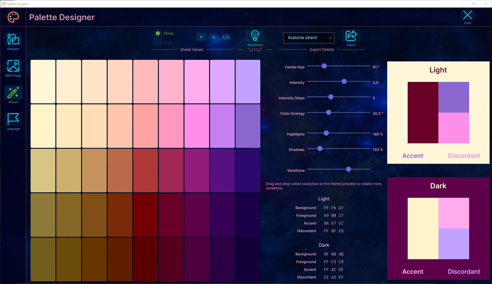

# Palette Designer

An Interactive tool to generate color palettes and themes, exporting design projects to 
ADOBE ASE / ACO formats, CSS for use on the web, 
and also XAML, AXAML and JSON for use in various desktop or mobile applications, such as Uno, Avalonia or WPF applications.

# Palette from Color Wheel

Can export the palette to the following formats: Avalonia aXAML, WPF XAML, Uno XAML, CSS, Adobe ASE / ACO, JSON.

# Palette from any Image Shades

Uses KMeans algorithm to extract the most dominant colors from any image. 
Images are converted to the CIELAB color space for better and more accurate results.

# New ! A 'Wizard' mode to create palettes, very easy to use...

Create colorful palettes and themes by just moving a few sliders!

# Localization

- Human translated: Italian, French and English.

- Machine translated: Spanish, Ukrainian, Bulgarian, Armenian, Greek, German, Japanese, Chinese, Korean, Magyar, Hindi and Bengali. 
 

# Download

https://github.com/LaurentInSeattle/PaletteDesigner/blob/main/Download/PaletteDesigner.zip 

You can also download the latest release from the Releases section.

# Or... Build it...

- Clone this repo'
- => Clone the "Lyt.Framework" repo' side by side. (https://github.com/LaurentInSeattle/Lyt.Framework)
- => Clone the "Lyt.Avalonia" repo' side by side. (https://github.com/LaurentInSeattle/Lyt.Avalonia)
- Open the solution in Visual Studio, restore nugets, then clean and build.

Developed and tested with .Net 10, Visual Studio 2026 18.1 and Avalonia 11.3.10.
Should most likely work with Jet Brains Rider, but not tested yet.
