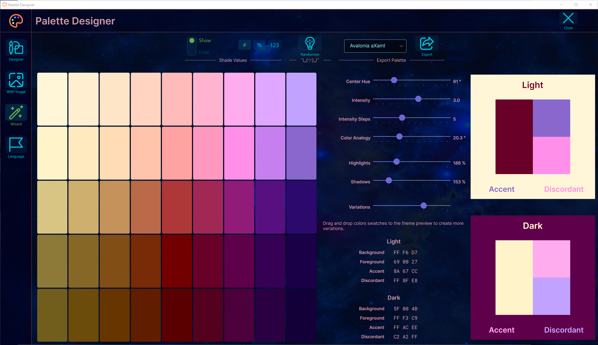

# Palette Designer

An Avalonia based interactive tool to generate color palettes and themes, exporting design projects to 
ADOBE ASE / ACO formats, CSS for use on the web, 
and also XAML, AXAML, plain text and JSON for use in various desktop or mobile applications, such as Uno, Avalonia or WPF applications.

# Download

Soon available on the Windows app' store... 

# Palette from Color Wheel

Can export the palettes to the following formats: Avalonia aXAML, WPF / UWP / UNO XAML, Paint.Net , CSS, Adobe ASE / ACO, JSON.

# Palette from any Image Shades

Uses the KMeans algorithm to extract the most dominant colors from any image. 
Images are converted to the CIELAB color space for better and more accurate results.

# A 'Wizard' mode to create palettes, very easy to use...

Create colorful palettes and themes by just moving a few sliders!

# Localization

- Human translated: Italian, French and English.

- Machine translated: Spanish, Ukrainian, Bulgarian, Armenian, Greek, German, Japanese, Chinese, Korean, Magyar, Hindi and Bengali. 
 

Help to fix the machine translations are very welcome! 
The translation files are in the "Languages" folder.

